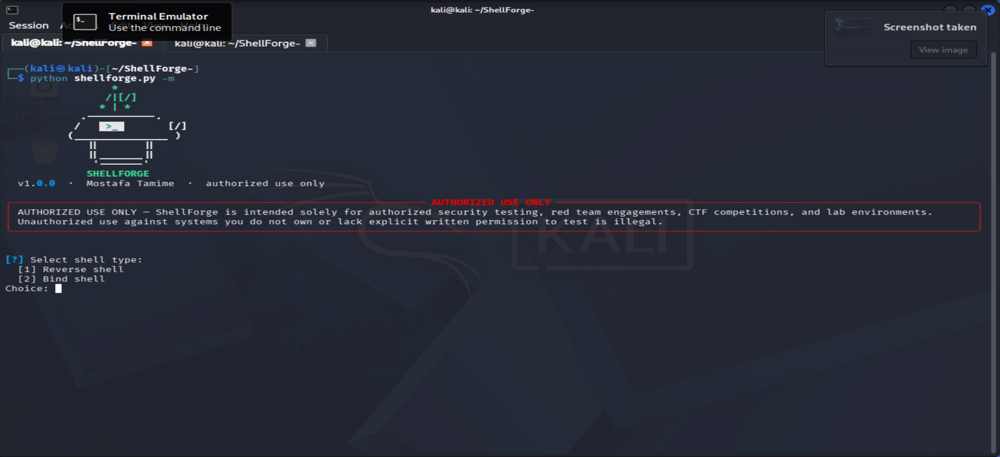
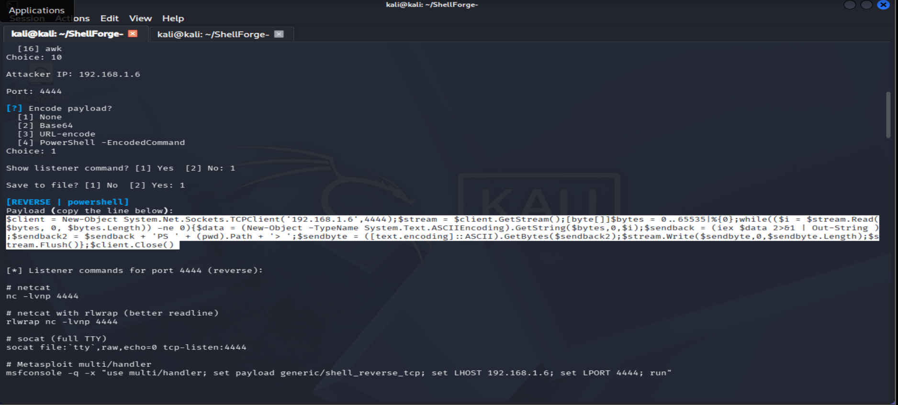
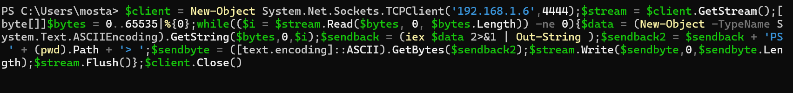
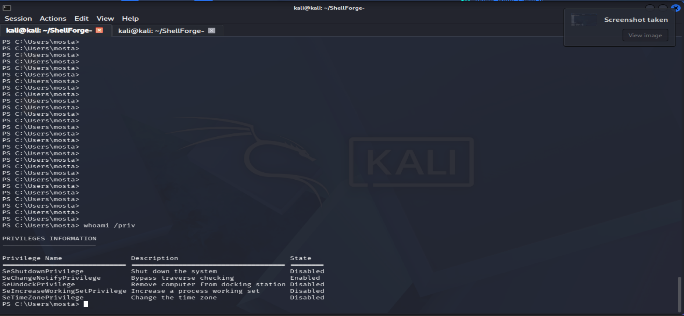

<p align="center">
  
</p>

<h1 align="center">ShellForge</h1>

<p align="center">Reverse and bind shell payload generator for labs, CTFs, and authorized engagements.</p>

<p align="center"><strong>Mostafa Tamime</strong></p>

## Why I built this

During CTFs and lab pentests I kept opening the same tabs — revshells.com, PayloadsAllTheThings, HackTricks — just to copy a bash one-liner or a PowerShell TCP client with a different IP and port. That got old fast. ShellForge is a small local CLI that prints those standard templates for me, with optional encoding and a quick listener reminder, so I can stay in the terminal instead of hunting through bookmarks mid-engagement.

> **Authorized use only**
>
> Use ShellForge only on systems you own or have explicit written permission to test. That means CTF targets, home labs, and scoped red team / pentest work. Running these payloads against anything else is illegal. You are responsible for how you use this tool.

## Features

- Reverse and bind shells for bash, Python, Perl, PHP, Ruby, netcat, socat, PowerShell, Java, C#, C, Go, Lua, and AWK
- Templates match the usual public references — clean `{IP}` / `{PORT}` substitution, no custom obfuscation
- `--output` writes `.ps1`, `.c`, `.java`, `.cs`, or `.go` when you need a file to drop or compile
- Encoders: base64, URL-encode, PowerShell `-EncodedCommand`
- `--listener` prints `nc`, `rlwrap`, `socat`, and an msfconsole multi/handler snippet
- New languages plug in via `generators/` plus a line in the `LANGUAGES` dict

## Installation

```bash
git clone https://github.com/<your-user>/shellforge.git
cd shellforge
pip install -r requirements.txt
```

Requires Python 3.9+. On Windows, `py` works if `python` is the Store stub.

## Usage

Run with no arguments (or `-m` / `--interactive`) for a prompted menu:

```bash
python shellforge.py
python shellforge.py -m
```

Basic bash reverse shell:

```bash
python shellforge.py -t reverse -i 10.10.14.5 -p 4444 -l bash
```

Bind shell on the target side:

```bash
python shellforge.py -t bind -p 5555 -l python3
```

PowerShell as a saved script (useful when a one-liner is awkward to paste):

```bash
python shellforge.py -t reverse -i 10.10.14.5 -p 443 -l powershell -o reverse.ps1
```

Encode before you copy it out:

```bash
python shellforge.py -t reverse -i 10.10.14.5 -p 4444 -l bash --encode base64
python shellforge.py -t reverse -i 10.10.14.5 -p 4444 -l powershell --encode ps-encoded
```

Generate a payload and print matching listeners in one shot:

```bash
python shellforge.py -t reverse -i 10.10.14.5 -p 4444 -l bash --listener
```

List everything the tool knows about:

```bash
python shellforge.py --list-langs
```

More walkthroughs live in [`examples/usage_examples.md`](examples/usage_examples.md).

## Demo

Tested end-to-end on a lab setup: Kali (attacker) + a Windows target VM, generating a PowerShell reverse shell through the interactive menu and catching it with netcat.

**Interactive mode — selecting shell type and options**



**Generated PowerShell reverse shell payload with listener commands**



**Payload pasted into a live PowerShell session on the target**



**Shell caught — running `whoami /priv` on the target through the reverse connection**



## Project structure

```
shellforge/
├── shellforge.py          # CLI entrypoint
├── generators/            # one module per language/tool
├── encoders/encode.py
├── listeners/listener_helper.py
├── assets/logo.svg
├── docs/screenshots/      # demo screenshots
├── tests/
└── examples/
```

## Testing

```bash
pip install pytest
pytest -q
```

## Roadmap

A few things I might add next, in no particular order:

- Windows cmd / mshta / certutil helper one-liners next to the existing PowerShell generator
- Optional TTY upgrade cheat-sheet printed after a Linux reverse shell (python pty, stty raw, etc.)
- A `--format raw|commented` flag so file-oriented languages can emit either a bare payload or a short compile/run header

## License

MIT. See [LICENSE](LICENSE).

**Author:** Mostafa Tamime
